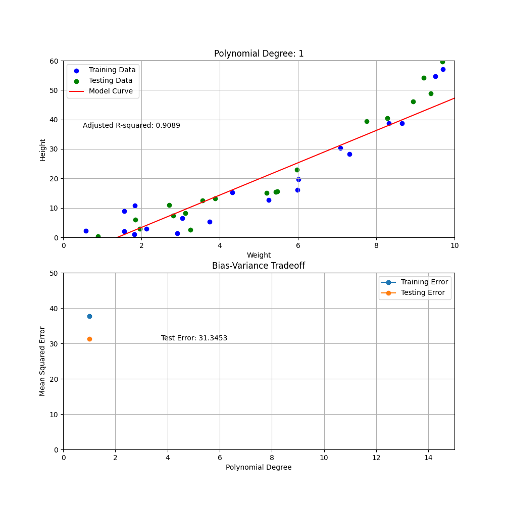

# Minimizing Test Error for Optimal Polynomial Degree in Polynomial Regression

In polynomial regression, choosing the appropriate degree of the polynomial is crucial for creating a model that generalizes well to unseen data. An incorrect polynomial degree can lead to either underfitting or overfitting, both of which result in poor model performance.

## Concept of Overfitting and Underfitting

- **Underfitting**: When the polynomial degree is too low, the model is too simple to capture the underlying pattern in the data. This results in high bias and poor performance on both training and testing data.
- **Overfitting**: When the polynomial degree is too high, the model becomes too complex and starts capturing noise in the training data. This results in low training error but high testing error due to poor generalization. IOWs the model fits too well to the training data, but will perform poorly with any test data it never encountered before.

## Bias-Variance Tradeoff

The bias-variance tradeoff is a fundamental concept in machine learning. It describes the tradeoff between the error due to bias (error from erroneous assumptions in the learning algorithm) and the error due to variance (error from sensitivity to small fluctuations in the training set).
While intuitively simple, it is one of those concept that it takes a life long to master.

## Choosing the Optimal Polynomial Degree

To choose the optimal polynomial degree, we aim to minimize the test error, which measures how well the model generalizes to unseen data. By plotting the mean squared error (MSE) for both training and testing data against different polynomial degrees, we can observe the following:

1. **Training Error**: Generally decreases as the polynomial degree increases because the model becomes more flexible and can fit the training data better.
2. **Testing Error**: Initially decreases as the polynomial degree increases, reaches a minimum point, and then starts increasing due to overfitting.

The optimal polynomial degree is the one that minimizes the testing error, achieving a balance between bias and variance.

## Visualization

Here's an example visualization illustrating the concepts, as an animation:

The animation consists of two plots:

1. **Top Plot (Polynomial Regression for Degree: 1 - 15)**:
   - **Data Points**: Blue dots represent training data, and green dots represent testing data.
   - **Model Curve**: The red line represents the polynomial regression model for the polynomial degree from 1 to 15.
   - **Adjusted R-squared**: indicating the proportion of variance in the dependent variable that is predictable from the independent variable.

2. **Bottom Plot (Bias-Variance Tradeoff)**:
   - **Mean Squared Error (MSE)**: Plotted against polynomial degrees ranging from 1 to 15.
   - **Training Error**: Represented by the blue line.
   - **Testing Error**: Represented by the orange line.
   - **Test Error**: The minimum test error is 11.3056, indicating the optimal polynomial degree.

These plots illustrate the importance of selecting the appropriate polynomial degree to minimize the test error and achieve a model that generalizes well to unseen data.

