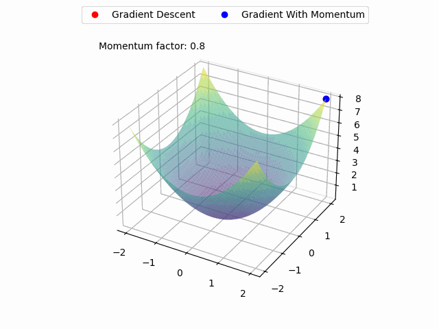

# Machine Learning Animations

## Table of Contents
- [Minimizing Test Error for Optimal Polynomial Degree in Polynomial Regression](#minimizing-test-error-for-optimal-polynomial-degree-in-polynomial-regression)
- [Gradient Descent](#gradient-descent)
- [Gradient Descent versus Gradient Descent with Momentum](#gradient-descent-versus-gradient-descent-with-momentum)

# Minimizing Test Error for Optimal Polynomial Degree in Polynomial Regression

In polynomial regression, choosing the appropriate degree of the polynomial is crucial for creating a model that generalizes well to unseen data. An incorrect polynomial degree can lead to either underfitting or overfitting, both of which result in poor model performance.

## Concept of Overfitting and Underfitting

- **Underfitting**: When the polynomial degree is too low, the model is too simple to capture the underlying pattern in the data. This results in high bias and poor performance on both training and testing data.
- **Overfitting**: When the polynomial degree is too high, the model becomes too complex and starts capturing noise in the training data. This results in low training error but high testing error due to poor generalization. IOWs the model fits too well to the training data, but will perform poorly with any test data it never encountered before.

## Bias-Variance Tradeoff

The bias-variance tradeoff is a fundamental concept in machine learning. It describes the tradeoff between the error due to bias (error from erroneous assumptions in the learning algorithm) and the error due to variance (error from sensitivity to small fluctuations in the training set).
While intuitively simple, it is one of those concept that it takes a life long to master.

## Choosing the Optimal Polynomial Degree

To choose the optimal polynomial degree, we aim to minimize the test error, which measures how well the model generalizes to unseen data. By plotting the mean squared error (MSE) for both training and testing data against different polynomial degrees, we can observe the following:

1. **Training Error**: Generally decreases as the polynomial degree increases because the model becomes more flexible and can fit the training data better.
2. **Testing Error**: Initially decreases as the polynomial degree increases, reaches a minimum point, and then starts increasing due to overfitting.

The optimal polynomial degree is the one that minimizes the testing error, achieving a balance between bias and variance.

## Visualization

Here's an example visualization illustrating the concepts, as an animation:

The animation consists of two plots:

1. **Top Plot (Polynomial Regression for Degree: 1 - 15)**:
   - **Data Points**: Blue dots represent training data, and green dots represent testing data.
   - **Model Curve**: The red line represents the polynomial regression model for the polynomial degree from 1 to 15.
   - **Adjusted R-squared**: indicating the proportion of variance in the dependent variable that is predictable from the independent variable.

2. **Bottom Plot (Bias-Variance Tradeoff)**:
   - **Mean Squared Error (MSE)**: Plotted against polynomial degrees ranging from 1 to 15.
   - **Training Error**: Represented by the blue line.
   - **Testing Error**: Represented by the orange line.
   - **Test Error**: The minimum test error is 11.3056, indicating the optimal polynomial degree.

These plots illustrate the importance of selecting the appropriate polynomial degree to minimize the test error and achieve a model that generalizes well to unseen data.

## Gradient Descent 
Explain the concept of Gradient Descent, including visualizations or animations to help understand how this optimization algorithm works.
# Gradient Descent

Gradient Descent is an optimization algorithm used to minimize the cost function in machine learning models. It is a powerful and widely-used technique, especially for training neural networks and linear regression models. In this section, we will walk through the concept of Gradient Descent, its importance, and how it works in a step-by-step manner.

## Table of Contents
- [What is Gradient Descent?](#what-is-gradient-descent)
- [The Cost Function](#the-cost-function)
- [How Gradient Descent Works](#how-gradient-descent-works)
- [Learning Rate](#learning-rate)
- [Types of Gradient Descent](#types-of-gradient-descent)
- [Convergence and Stopping Criteria](#convergence-and-stopping-criteria)

## What is Gradient Descent?
Gradient Descent is an iterative optimization algorithm used to find the minimum value of a function. In the context of machine learning, this function is typically the cost function (or loss function), which measures how well a model is performing. The goal is to adjust the model's parameters to minimize the cost function, thus improving the model's accuracy.

## The Cost Function
The cost function, often denoted as \( J(\theta) \), measures the difference between the model's predictions and the actual target values. It is a mathematical representation of the error. For example, in linear regression, the cost function is usually the Mean Squared Error (MSE):

\[ J(\theta) = \frac{1}{2m} \sum_{i=1}^{m} (h_\theta(x^{(i)}) - y^{(i)})^2 \]

Where:
- \( m \) is the number of training examples
- \( h_\theta(x) \) is the hypothesis function (predictions)
- \( y \) are the actual target values

## How Gradient Descent Works
Gradient Descent works by iteratively updating the model's parameters to move towards the minimum value of the cost function. The key steps are as follows:

1. **Initialize Parameters**: Start with an initial guess for the model parameters (e.g., weights and biases).
2. **Compute the Gradient**: Calculate the gradient (partial derivative) of the cost function with respect to each parameter. The gradient indicates the direction and rate of the steepest increase of the cost function.
3. **Update Parameters**: Adjust the parameters in the opposite direction of the gradient to decrease the cost function. The update rule is:

   

\[ \theta := \theta - \alpha \nabla J(\theta) \]

   Where:
   - \( \alpha \) is the learning rate (a small positive value)
   - \( \nabla J(\theta) \) is the gradient of the cost function

4. **Repeat**: Continue iterating until the cost function converges to a minimum value or a stopping criterion is met.

## Learning Rate
The learning rate (\( \alpha \)) is a crucial hyperparameter that controls the step size of each iteration. If the learning rate is too large, the algorithm may overshoot the minimum, causing it to diverge. If the learning rate is too small, the algorithm will take too long to converge. Choosing an appropriate learning rate is essential for efficient training.

## Types of Gradient Descent
There are three main types of Gradient Descent:

1. **Batch Gradient Descent**: Uses the entire training dataset to compute the gradient. This can be computationally expensive for large datasets but provides a stable convergence.

2. **Stochastic Gradient Descent (SGD)**: Uses one training example at each iteration to compute the gradient. This introduces noise in the optimization process but can converge faster on large datasets.

3. **Mini-Batch Gradient Descent**: Combines aspects of both batch and stochastic gradient descent. It uses a subset (mini-batch) of the training data to compute the gradient at each iteration. This balances convergence speed and stability.

## Convergence and Stopping Criteria
Gradient Descent algorithms use various criteria to determine when to stop iterating, such as:

- **Cost Function Threshold**: Stop when the cost function decreases below a certain threshold.
- **Gradient Norm**: Stop when the magnitude of the gradient is close to zero.
- **Maximum Iterations**: Stop after a predefined number of iterations.

Choosing appropriate stopping criteria ensures that the model converges efficiently without unnecessary computations.

In summary, Gradient Descent is a fundamental optimization technique in machine learning, enabling models to learn from data by iteratively minimizing the cost function. Understanding how Gradient Descent works and tuning its parameters effectively are crucial for building accurate and efficient machine learning models.

## Gradient Descent versus Gradient Descent with Momentum
# Gradient Descent with Momentum

Gradient Descent with Momentum is an advanced optimization algorithm that builds upon the standard Gradient Descent by introducing a momentum term. This technique helps accelerate convergence, especially in the presence of noisy gradients and in scenarios where the cost function has ravines or valleys. In this section, we will explore the concept of Gradient Descent with Momentum, its benefits, and how it works.

## Table of Contents
- [What is Gradient Descent with Momentum?](#what-is-gradient-descent-with-momentum)
- [The Need for Momentum](#the-need-for-momentum)
- [How Gradient Descent with Momentum Works](#how-gradient-descent-with-momentum-works)
- [Hyperparameters](#hyperparameters)
- [Advantages of Gradient Descent with Momentum](#advantages-of-gradient-descent-with-momentum)
- [Convergence and Practical Tips](#convergence-and-practical-tips)

## What is Gradient Descent with Momentum?
Gradient Descent with Momentum is an optimization algorithm that improves upon standard Gradient Descent by adding a momentum term to the parameter updates. This momentum term helps to smooth out the updates, leading to faster and more stable convergence.

## The Need for Momentum
In standard Gradient Descent, the updates to the parameters can be erratic, especially when the cost function has steep slopes or noisy gradients. This can lead to slow convergence or even getting stuck in local minima. The momentum term helps to address these issues by considering the previous updates, allowing the algorithm to build up speed in the relevant direction and dampen oscillations.

## How Gradient Descent with Momentum Works
The key idea behind Gradient Descent with Momentum is to add a fraction of the previous update vector to the current update. The steps are as follows:

1. **Initialize Parameters and Momentum Term**: Start with initial guesses for the model parameters (e.g., weights and biases) and initialize the momentum term (usually set to zero).

2. **Compute the Gradient**: Calculate the gradient (partial derivative) of the cost function with respect to each parameter.

3. **Update the Momentum Term**: Adjust the momentum term by adding a fraction of the previous momentum and the current gradient:

   

\[ v_t = \beta v_{t-1} + (1 - \beta) \nabla J(\theta) \]

   Where:
   - \( v_t \) is the current momentum term.
   - \( \beta \) is the momentum hyperparameter (a value between 0 and 1).
   - \( \nabla J(\theta) \) is the gradient of the cost function.

4. **Update Parameters**: Adjust the parameters using the momentum term:

   

\[ \theta := \theta - \alpha v_t \]

   Where:
   - \( \alpha \) is the learning rate.
   - \( v_t \) is the updated momentum term.

5. **Repeat**: Continue iterating until the cost function converges to a minimum value or a stopping criterion is met.

Using momentum=0.8 and learning rate=0.01

## Hyperparameters
Gradient Descent with Momentum introduces an additional hyperparameter, the momentum coefficient (\( \beta \)). Choosing an appropriate value for \( \beta \) is crucial for the algorithm's performance. Typical values range from 0.8 to 0.99. A higher value places more weight on the previous updates, leading to smoother and faster convergence.

Using momentum=0.9 and learning rate=0.05 (oscillations)

## Advantages of Gradient Descent with Momentum
- **Faster Convergence**: Momentum helps to accelerate the convergence, especially in the presence of steep slopes or flat regions in the cost function.
- **Reduced Oscillations**: By considering previous updates, momentum dampens oscillations and leads to a more stable optimization process.
- **Overcoming Local Minima**: The accumulated momentum can help the algorithm escape shallow local minima by carrying it through to deeper regions of the cost function.

## Convergence and Practical Tips
- **Learning Rate and Momentum**: Carefully tune both the learning rate and momentum coefficient. A good balance is essential for efficient convergence.
- **Batch Size**: Using mini-batch Gradient Descent with Momentum can further improve convergence speed and stability.
- **Monitoring**: Regularly monitor the cost function to ensure that the algorithm is converging and not diverging.

In summary, Gradient Descent with Momentum is a powerful optimization technique that enhances the standard Gradient Descent by introducing a momentum term. This leads to faster and more stable convergence, making it especially useful for training deep neural networks and other complex machine learning models.

